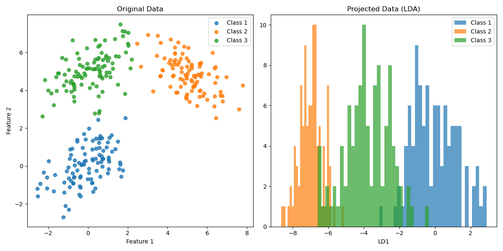
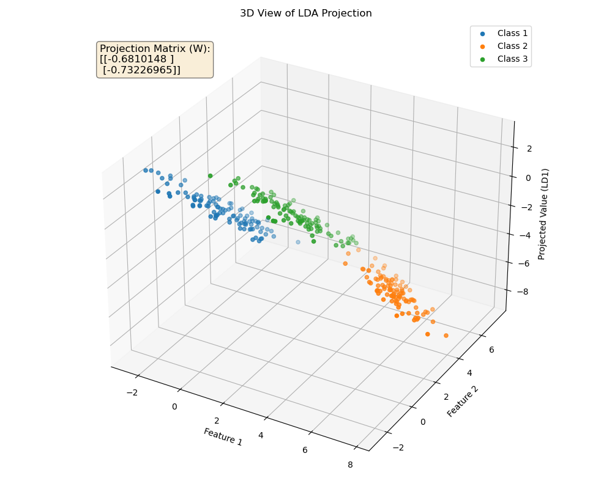
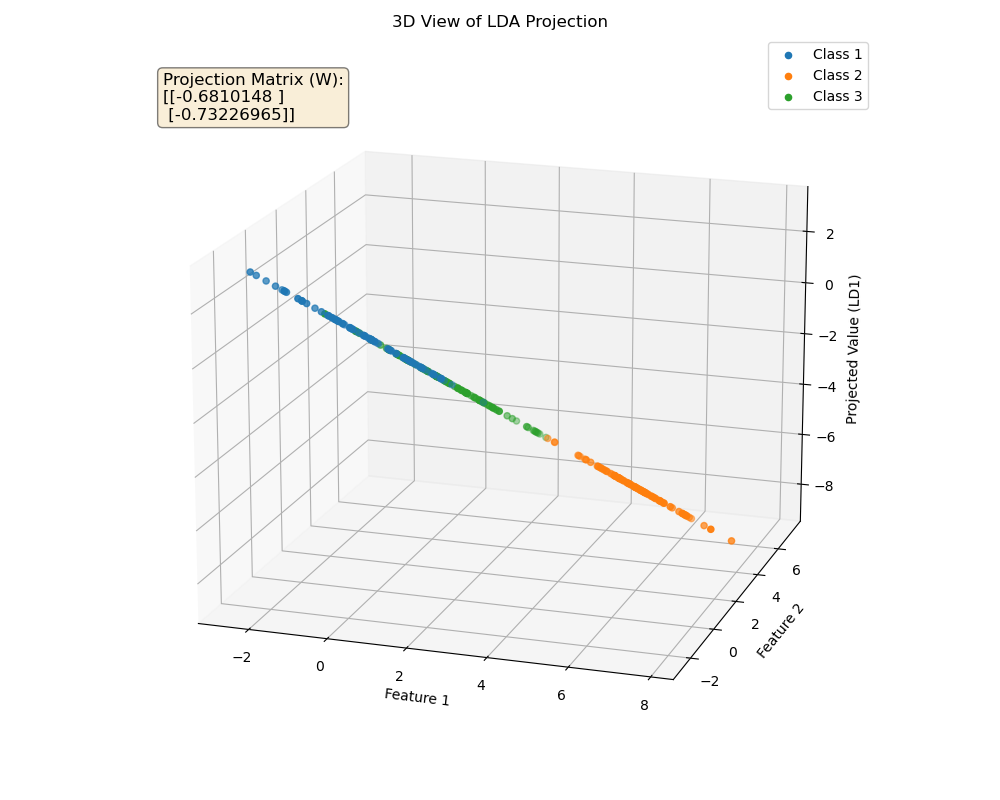

# LDA Demo

This repository contains a small demo of Linear Discriminant Analysis (LDA) implemented in `lda_demo.py`.

The script generates three synthetic 2D classes, computes the LDA projection, and saves two visualization files:

- `lda_demo.png` — 2D original data and histogram of the projected data (LD1)
- `lda_demo_3d.png` — 3D view showing the original features and the LD1 projection

## Files

- `lda_demo.py` — demo script (generates data, computes LDA, saves two PNGs and shows plots)
- `lda_demo.png` — generated 2D plot (created when you run the script)
- `lda_demo_3d.png` — generated 3D plot (created when you run the script)

## Requirements

- Python 3.8+ (any modern 3.x should work)
- `numpy`
- `matplotlib`

## Install (recommended: create a virtual environment)

PowerShell example:

```powershell
python -m venv .venv
.\.venv\Scripts\Activate
python -m pip install --upgrade pip
python -m pip install numpy matplotlib
```

If you prefer a user install (no venv / no admin):

```powershell
python -m pip install --user numpy matplotlib
```

## Run

From the project root (where `lda_demo.py` is located):

```powershell
# Activate venv if used
# .\.venv\Scripts\Activate
python lda_demo.py
```

The script will save `lda_demo.png` and `lda_demo_3d.png` in the same directory and open the plots interactively.

## Output (embedded previews)







## Notes

- If the images do not appear in the README preview, run the script to generate them and refresh the preview.
- If you get errors related to missing packages, ensure you installed `numpy` and `matplotlib` into the Python environment you are using.

If you'd like, I can also add a `requirements.txt` or a short PowerShell script to automate setup and run.
